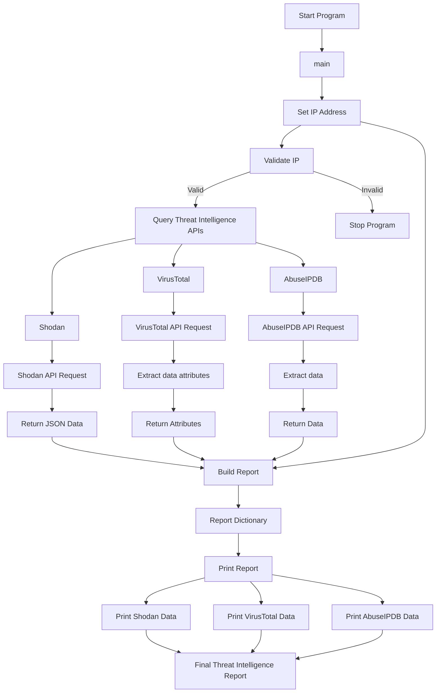

```mermaid
flowchart TD
    A[Start Program] --> B[main]

    B --> C[Set IP Address]
    C --> D[Validate IP]

    D -->|Valid| E[Query Threat Intelligence APIs]
    D -->|Invalid| F[Stop Program]

    E --> G[Shodan]
    E --> H[VirusTotal]
    E --> I[AbuseIPDB]

    G --> G1[Shodan API Request]
    G1 --> G2[Return JSON Data]

    H --> H1[VirusTotal API Request]
    H1 --> H2[Extract data attributes]
    H2 --> H3[Return Attributes]

    I --> I1[AbuseIPDB API Request]
    I1 --> I2[Extract data]
    I2 --> I3[Return Data]

    G2 --> J[Build Report]
    H3 --> J
    I3 --> J
    C --> J

    J --> K[Report Dictionary]

    K --> L[Print Report]

    L --> M[Print Shodan Data]
    L --> N[Print VirusTotal Data]
    L --> O[Print AbuseIPDB Data]

    M --> P[Final Threat Intelligence Report]
    N --> P
    O --> P
```